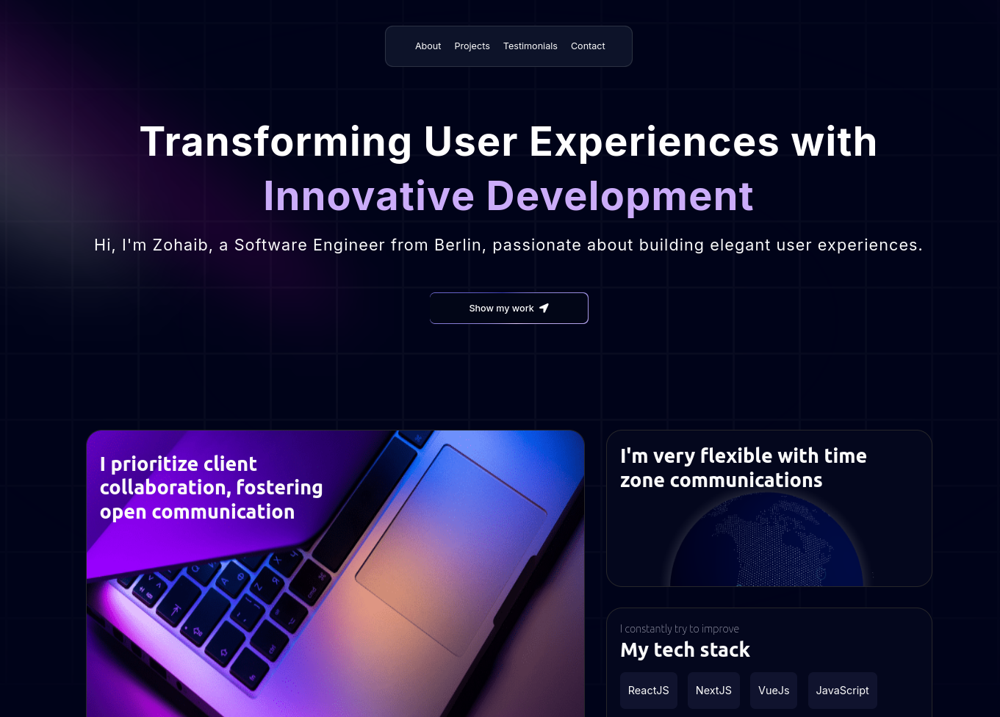

# Portfolio Website

This is my personal portfolio website, showcasing my skills, projects, and experience as a FullStack developer focused Frontend. The website serves as a space to highlight my work, experiences, including projects I have built using technologies like [ React, Vue, NextJS, Tailwind, Python, Django, RestAPI ].

Visit my [Portfolio](https://my-portfolio-iota-ten-10.vercel.app/) 

## ✨ Features

- **Responsive Design**: Mobile-friendly design for a seamless experience on all devices.
- **Interactive UI**: Smooth animations and modern UI/UX to engage users.
- **Project Showcase**: Detailed sections highlighting my work with project descriptions, links to repositories, and live demos.
- **Work Experience**: A section outlining my professional experience, highlighting the roles and projects I have been a part of.

- **Work Approach**: A dedicated section showcasing my approach to delivering high-quality projects, including the processes and methods I follow.
- **Testimonials**: A section featuring feedback and testimonials from clients or collaborators on the projects I've worked on.
- **Contact Form**: Integrated form for visitors to get in touch.

## 🛠️ Tech Stack

- **Frontend**: [ ReactJS, VueJS, NextJS, Tailwind, CSS, HTML5, CSS3, JavaScript ]
- **Backend**: [ Python, Django, Django-Rest-API, PostgreSql ]
- **Version Control**: [ Git & GitHub ]
- **Hosting**: [ GitHub Pages, AWS, Vercel ]
- **Other Tools**: [ Vite, Jest, AWS ]
